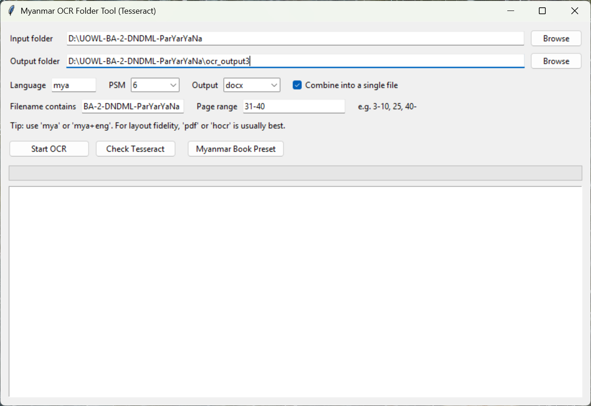

# Myanmar OCR Tool

A simple Windows desktop OCR workflow for Myanmar text using Tesseract.

## What is included

- `ocr_folder_ui.py`: batch OCR UI for image folders
- `combine_docx_master.py`: merge many DOCX files into one master DOCX
- `run_ocr_ui.bat`: quick launcher for the UI
- `OCR_User_Guide.md`: detailed usage guide

## Features

- OCR image formats: `png`, `jpg`, `jpeg`, `tif`, `tiff`, `bmp`, `webp`
- Output formats: `txt`, `md`, `docx`, `pdf`, `hocr`
- Filename filtering and page-range filtering
- Myanmar preset for books (`mya`, PSM `6`, PDF output)
- Natural-sort DOCX merge (`1,2,3,...,10,...`)

## Install (Windows)

1. Install Python 3.9+.
   Optional (Winget):

```powershell
winget install -e --id Python.Python.3.12
```

2. Confirm Python is available:

```powershell
python --version
```

3. Install Tesseract OCR.
   Optional (Winget):

```powershell
winget install -e --id UB-Mannheim.TesseractOCR
```

4. Confirm Tesseract is available:

```powershell
tesseract --version
```

5. Check that Myanmar language data is installed:

```powershell
tesseract --list-langs
```

You should see `mya` in the language list.

6. Install Python package dependency:

```powershell
python -m pip install --user python-docx
```

## Run

Option 1:

```powershell
python -B ocr_folder_ui.py
```

Option 2:

```powershell
run_ocr_ui.bat
```

## Combine DOCX files

```powershell
python -B combine_docx_master.py "D:\path\to\docx_folder"
```

Custom output:

```powershell
python -B combine_docx_master.py "D:\path\to\docx_folder" --output "D:\path\Master.docx"
```

## UI Preview



[Watch UI Demo Video](media/MM_OCR.mp4)

## Notes for GitHub sharing

- Keep OCR outputs and temporary files out of git (already handled by `.gitignore`).
- If you want to publish sample images, include only a small sample set.
- For very large datasets, use GitHub Releases or Git LFS.
